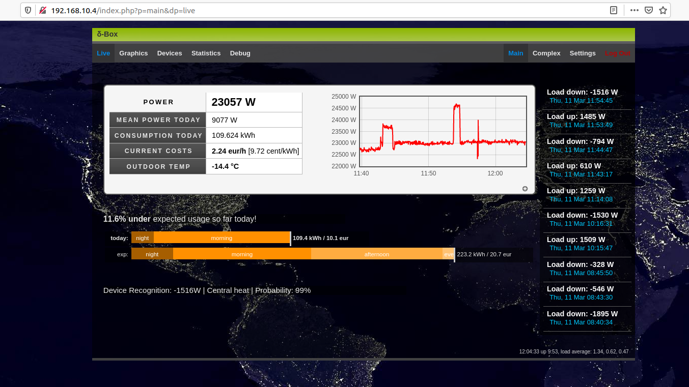
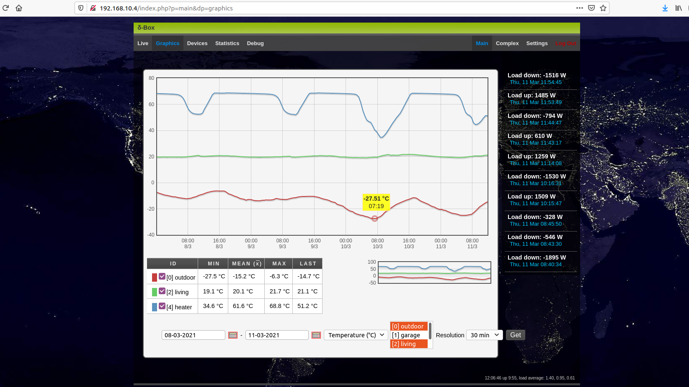

# IDEC
[](https://opensource.org/licenses/MIT)

# *Inverse Decomposition of Energy Consumption*


## What is it?

The idea behind <a href="https://en.wikipedia.org/wiki/Nonintrusive_load_monitoring">Non-Intrusive Load Monitoring</a> (NILM) is to solve an inverse problem of decomposing a superposition of different household electrical energy loads, based on observing only the time-series of the total load. This goal was pioneered by G.W. Hart, MIT. Solving this theoretical problem has also far reaching practical motivations, spanning from understanding large industrial system loads to reducing the overall world energy consumption.

</br>

Figure 1: An embedded web interface with real-time data.


## Algorithms

Embedded algorithms here include basic unsupervised and supervised machine learning techniques (<a href="https://en.wikipedia.org/wiki/K-means_clustering">K-means</a>, <a href="https://en.wikipedia.org/wiki/Fuzzy_clustering">Fuzzy K-means</a>, <a href="https://en.wikipedia.org/wiki/Expectation%E2%80%93maximization_algorithm">EM-clustering</a>, <a href="https://en.wikipedia.org/wiki/Naive_Bayes_classifier">Bayes classifier</a>), linear and non-linear signal processing (<a href="https://en.wikipedia.org/wiki/Filter_(signal_processing)">filtering</a>, <a href="https://en.wikipedia.org/wiki/Edge_detection">edge detection</a>) and a <a href="https://en.wikipedia.org/wiki/Genetic_algorithm">genetic algorithm</a> type combinatorial optimization for learning the <a href="https://en.wikipedia.org/wiki/Finite-state_machine">finite state machine</a>.


Figure 2: A diagram of <a href="https://en.wikipedia.org/wiki/Unambiguous_finite_automaton">unambiguous finite automaton</a> (from Wikipedia).

## Build it!

A working prototype was realized with an <a href="https://www.artila.com/en/">Artila</a> iPAC5010 ARM-linux embedded development card together with a custom photodiode circuit triggering on the optical output of a standard household energy meter (1k pulses/kWh). In addition, a 1-wire network support with "hot-plugging" onewire temperature sensors is included. The user interface is provided by an embedded web-server (<a href="https://en.wikipedia.org/wiki/Ajax_(programming)">async Javascript</a> front end, <a href="https://en.wikipedia.org/wiki/PHP">PHP</a> & <a href="https://en.wikipedia.org/wiki/C++">C++</a> back end). An SQL-database (<a href="https://en.wikipedia.org/wiki/SQLite">SQLite3</a>) is used for saving the measurement data. A modern ARM board with floating point support is recommended.

</br>

This prototype system was introduced and awarded in 2009 in a technical innovation competition IIDA09 at Tampere University of Technology (TUT), Finland.

</br>


Figure 3: An embedded web interface with time-series data.

</br>
</br>
(c) 2008-2009 Mikael Mieskolainen, TUT
</br>
</br>

### To-Be-Done

- [ ] Upload all data collected between 2009-2021
- [ ] Change all code comments to English
- [ ] Adapt the code for Rasperry Pi (only GPIO interfaces need modification)
- [ ] Implement modern algorithms, e.g. deep learning with self-supervision / matrix factorizations

</br>

## Full installation


1. Copy everything under ```/mnt/``` to the ARM board with SD card
2. Use GPIO port 8 for the energy meter trigger circuit
3. Connect ethernet
4. Connect onewire adapter into the serial port (optional)


#### System startup steering

Scripts under the following paths control the startup
```
/mnt/disk/etc/
/mnt/disk/
```

## Program sources

C++ real-time and web back-end programs
```
/source/{*.c, *.h, Makefile}
```

PHP web back-end + javascript front-end
```
/mnt/disk/home/
```

## Databases

Database files (sqlite3) collected with the prototype. Extract ```.db``` files from ```.tar.xz``` files.

```
/mnt/mmc/{*.db}
```

## Binaries

Compiled multithreaded real-time programs
```
/mnt/disk/powercalc
/mnt/disk/cluster
```

Compiled web back-end programs
```
/mnt/disk/home/httpd/apps/get_file_archive.cgi
/mnt/disk/home/httpd/apps/get_statistics.cgi
/mnt/disk/home/httpd/apps/socket_client.cgi
```

Additional standard programs utilized
```
/mnt/disk/php
/mnt/disk/openssl
/mnt/disk/cron
/mnt/disk/ntpclient
/mnt/disk/lighttpd/*
/mnt/disk/ntpd/*
/mnt/mmc/sqlite3 (for manually inspecting database files)
```

## Energy meter optical output trigger circuit

The components of the read-out circuit are

* Reverse biased photosensitive PN-diode
* Bipolar transistor + bias resistors
* Voltage source
* Cabling


## External libraries utilized

#### C-Libraries

```
Database: SQLite3 https://www.sqlite.org/ (Public domain)
1-Wire: Dallas/Maxim  driver C-libraries ((C) 2000 Dallas Semiconductor Corporation)
```

#### Javascript

```
JQuery https://jquery.com/ (MIT license)
prototype.js http://prototypejs.org/ (MIT license)
script.aculo.us https://script.aculo.us/ (MIT license)
ContentFlow http://contentflow.eu (MIT license)
DHTML calendar (LGPL license)
```
